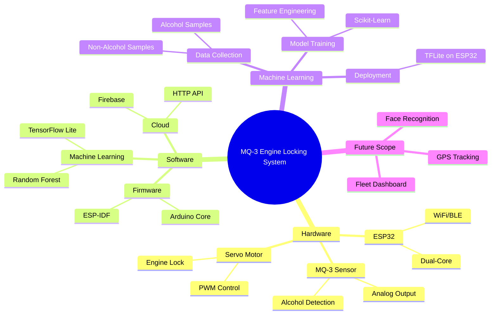

# **MQ-3 Based Intelligent Engine Locking System with Machine Learning**  
### **IoT & ML-Powered Drunk Driving Prevention System**  

## **Table of Contents**  
1. [Project Overview](#-project-overview)  
2. [System Architecture](#-system-architecture)  
3. [Mind Map](#-mind-map)  
4. [Installation](#-installation)  
5. [Usage](#-usage)  
6. [Contributing](#-contributing)  
7. [License](#-license)  

---

## **Project Overview**  
An **IoT + Machine Learning** system to prevent drunk driving by:  
- Detecting alcohol levels using **MQ-3 sensor**.  
- Using **ML (Random Forest)** to reduce false positives.  
- Locking the engine via **servo mechanism**.  
- Sending real-time alerts to **police & fleet managers**.  

**Why ML?**  
- Traditional threshold-based systems fail due to false triggers (perfume, sanitizer).  
- **ML improves accuracy** by learning alcohol patterns.  

---

## **System Architecture**  
### **Hardware Components**  
| Component        | Role                          |  
|------------------|-------------------------------|  
| **ESP32**        | Brain (WiFi + ML Inference)    |  
| **MQ-3 Sensor**  | Detects Alcohol Concentration  |  
| **Servo Motor**  | Locks/Unlocks Engine          |  
| **Buzzer**       | Audio Alert                   |  
| **LED**          | Visual Warning                |  

### **Software Stack**  
- **ESP-IDF/Arduino Core** (Firmware)  
- **TensorFlow Lite** (ML on Edge)  
- **Firebase/HTTP API** (Cloud Alerts)  

---

## **Mind Map**  


---

## **Installation**  
1. **Hardware Setup**  
   - Connect MQ-3 to ESP32's `GPIO34`.  
   - Attach servo to `GPIO13`.  

2. **Software Setup**  
   ```bash
   git clone https://github.com/yourusername/mq3-engine-locking-system.git
   cd mq3-engine-locking-system
   ```
   - Open in **Arduino IDE/PlatformIO**.  
   - Install libraries:  
     ```bash
     pio lib install "TensorFlowLite"
     pio lib install "WiFi"
     ```

---

## **Usage**  
1. **Calibrate Sensor**  
   - Run `calibrate.ino` to set baseline alcohol levels.  

2. **Deploy ML Model**  
   - Replace `alcohol_model.h` with your trained TFLite model.  

3. **Run Main Program**  
   - Upload `main.ino` to ESP32.  
   - System will:  
     - Monitor alcohol levels.  
     - Lock engine if drunk driving detected.  
     - Send alerts via WiFi.
     - 
---

## **📊 Sample Output**  
| Alcohol Level (ppm) | ML Prediction | Action Taken          |  
|---------------------|---------------|-----------------------|  
| 200                 | Safe (0)      | Engine Unlocked       |  
| 1800                | Drunk (1)     | Engine Locked + Alert |  

---
